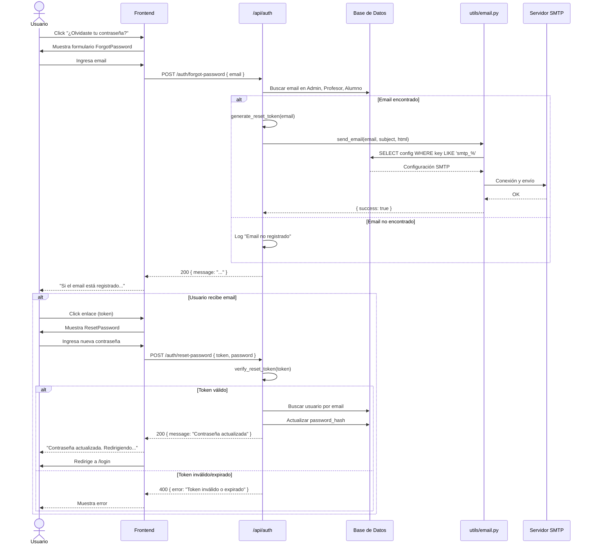
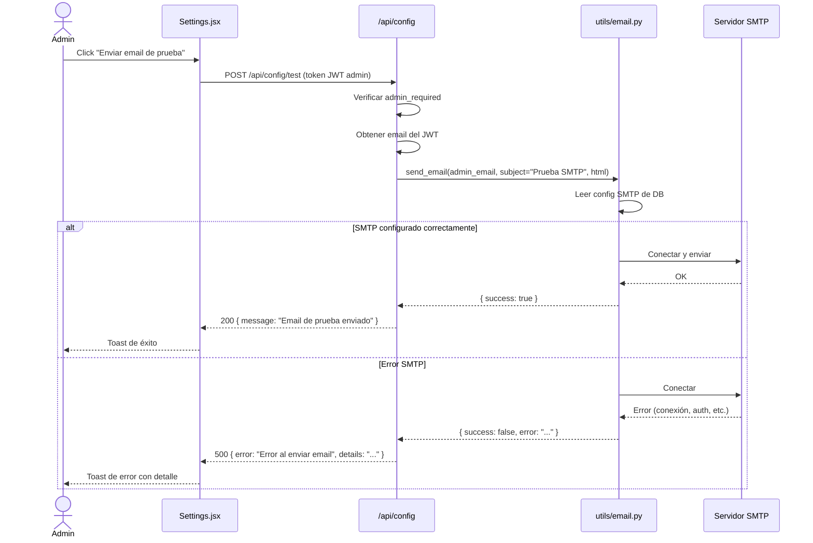
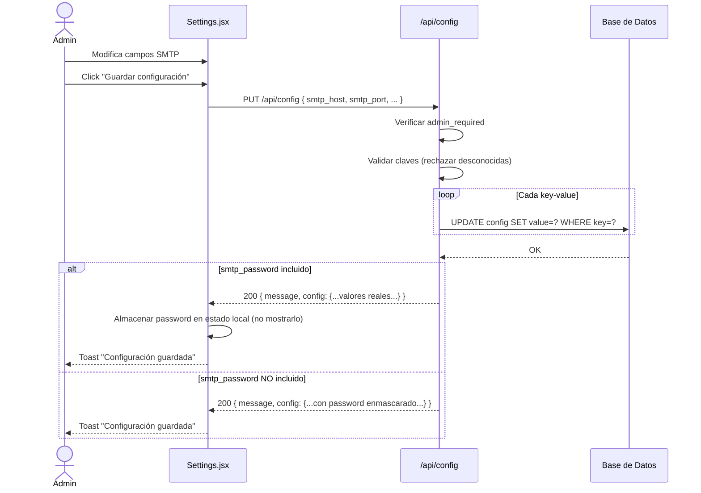

# Design Document: Sistema de Email y Recuperación de Contraseña

**Change**: `email-recovery`
**Proyecto**: Portal de Alumnos — Universidad Felipe Villanueva
**Fecha**: 2026-06-19
**Autor**: AI Architect

---

## 1. Arquitectura General

### 1.1 Diagrama de Capas

```
┌─────────────────────────────────────────────────────────────┐
│                     Frontend (React)                         │
│  Login.jsx ──→ ForgotPassword.jsx ──→ ResetPassword.jsx     │
│  Sidebar.jsx ──→ Settings.jsx (admin only)                  │
└──────────────────────┬──────────────────────────────────────┘
                       │ HTTP (axios)
┌──────────────────────▼──────────────────────────────────────┐
│                   Backend (Flask)                            │
│  ┌──────────┐  ┌─────────────────────┐  ┌───────────────┐  │
│  │ auth_bp  │  │   settings_bp       │  │  utils/       │  │
│  │ /api/auth│  │   /api/config       │  │  email.py     │  │
│  │          │  │                     │  │  security.py  │  │
│  │ forgot   │  │ GET /               │  │               │  │
│  │ reset    │  │ PUT /               │  │ generate_     │  │
│  │          │  │ POST /test          │  │ reset_token() │  │
│  └────┬─────┘  └─────────┬───────────┘  └───────┬───────┘  │
│       │                  │                       │          │
│       ▼                  ▼                       ▼          │
│  ┌──────────────────────────────────────────────────────┐   │
│  │                    models.py                          │   │
│  │  Admin | Profesor | Alumno | Config                  │   │
│  └──────────────────────────────────────────────────────┘   │
│                           │                                 │
│                           ▼                                 │
│                     SQLite / PostgreSQL                     │
└─────────────────────────────────────────────────────────────┘
```

### 1.2 Nuevos Archivos

| Archivo | Tipo | Propósito |
|---------|------|-----------|
| `backend/utils/email.py` | **NUEVO** | Wrapper SMTP con `smtplib` |
| `backend/routes/settings.py` | **NUEVO** | Blueprint `settings_bp` para configuración SMTP |
| `frontend/src/pages/auth/ForgotPassword.jsx` | **NUEVO** | Formulario de email para recuperación |
| `frontend/src/pages/auth/ResetPassword.jsx` | **NUEVO** | Formulario de nueva contraseña con token |
| `frontend/src/pages/admin/Settings.jsx` | **NUEVO** | Panel de configuración SMTP (admin) |
| `frontend/src/api/settings.js` | **NUEVO** | API module para endpoints de configuración |

### 1.3 Archivos Modificados

| Archivo | Cambio |
|---------|--------|
| `backend/models.py` | + modelo `Config` |
| `backend/utils/security.py` | + `generate_reset_token()`, `verify_reset_token()` |
| `backend/routes/auth.py` | + `POST /auth/forgot-password`, `POST /auth/reset-password` |
| `backend/app.py` | + registro `settings_bp` |
| `frontend/src/api/auth.js` | + `forgotPassword()`, `resetPassword()` |
| `frontend/src/pages/auth/Login.jsx` | + link "¿Olvidaste tu contraseña?" |
| `frontend/src/App.jsx` | + rutas para ForgotPassword, ResetPassword, Settings |
| `frontend/src/components/layout/Sidebar.jsx` | + item "Configuración" en adminNavItems |

---

## 2. Base de Datos

### 2.1 Nuevo Modelo: `Config`

```python
class Config(db.Model):
    """Modelo key-value para configuración del sistema"""
    __tablename__ = 'config'
    
    id = db.Column(db.Integer, primary_key=True)
    key = db.Column(db.String(100), unique=True, nullable=False)
    value = db.Column(db.Text, nullable=True)
    updated_at = db.Column(db.DateTime, default=datetime.utcnow, onupdate=datetime.utcnow)
    
    def to_dict(self):
        return {
            'id': self.id,
            'key': self.key,
            'value': self.value,
            'updated_at': self.updated_at.isoformat() if self.updated_at else None
        }
```

### 2.2 DDL Equivalente

```sql
CREATE TABLE config (
    id          INTEGER PRIMARY KEY AUTOINCREMENT,
    key         VARCHAR(100) UNIQUE NOT NULL,
    value       TEXT,
    updated_at  DATETIME DEFAULT CURRENT_TIMESTAMP
);
```

### 2.3 Claves por Defecto

| Key | Valor por Defecto | Descripción |
|-----|-------------------|-------------|
| `smtp_host` | `""` | Host del servidor SMTP |
| `smtp_port` | `587` | Puerto SMTP |
| `smtp_email` | `""` | Email remitente / usuario SMTP |
| `smtp_password` | `""` | Contraseña SMTP (texto plano en V1) |
| `smtp_use_tls` | `"true"` | Usar TLS (`true`/`false`) |
| `app_name` | `"Portal de Calificaciones"` | Nombre de la aplicación (personalizable) |
| `app_logo_url` | `""` | URL del logo (personalizable) |

### 2.4 Seed de Configuración

En `app.py`, después de `db.create_all()`, se insertan las claves por defecto si no existen:

```python
from models import Config
defaults = {
    'smtp_host': '', 'smtp_port': '587', 'smtp_email': '',
    'smtp_password': '', 'smtp_use_tls': 'true',
    'app_name': 'Portal de Calificaciones', 'app_logo_url': '',
}
for key, value in defaults.items():
    if not Config.query.filter_by(key=key).first():
        db.session.add(Config(key=key, value=value))
db.session.commit()
```

---

## 3. Backend Endpoints

### 3.1 Blueprint: `settings_bp` (nuevo archivo `backend/routes/settings.py`)

Prefijo: `/api/config`

#### `GET /api/config`

Obtener toda la configuración del sistema.

- **Auth**: `@admin_required`
- **Respuesta `200`**:
```json
{
  "config": {
    "smtp_host": "smtp.gmail.com",
    "smtp_port": "587",
    "smtp_email": "noreply@universidadfv.edu.mx",
    "smtp_password": "****",
    "smtp_use_tls": "true",
    "app_name": "Portal de Calificaciones",
    "app_logo_url": ""
  }
}
```

- **Nota**: El valor de `smtp_password` se retorna enmascarado (`****`) por seguridad. Solo se envía el valor real en la respuesta del `PUT` cuando se actualiza.

#### `PUT /api/config`

Actualizar configuración en bulk.

- **Auth**: `@admin_required`
- **Body**: objeto con pares key-value a actualizar
```json
{
  "smtp_host": "smtp.gmail.com",
  "smtp_port": "587",
  "smtp_email": "noreply@universidadfv.edu.mx",
  "smtp_password": "app-password-123",
  "smtp_use_tls": "true"
}
```
- **Respuesta `200`**:
```json
{
  "message": "Configuración actualizada",
  "config": { "...valores actualizados..." }
}
```

- Comportamiento: actualiza SOLO las claves enviadas, las no incluidas quedan intactas.
- Valida que las claves existan en la tabla (rechaza claves desconocidas con `400`).

#### `POST /api/config/test`

Enviar email de prueba al admin autenticado.

- **Auth**: `@admin_required`
- **Body**: vacío (el email se obtiene del JWT del admin)
- **Respuesta `200`**:
```json
{
  "message": "Email de prueba enviado exitosamente"
}
```
- **Respuesta `500`** (error SMTP):
```json
{
  "error": "Error al enviar email de prueba",
  "details": "Connection refused: ..."
}
```

### 3.2 Blueprint: `auth_bp` (modificaciones en `backend/routes/auth.py`)

#### `POST /api/auth/forgot-password`

Solicitar recuperación de contraseña.

- **Auth**: pública (sin token)
- **Rate limit**: `@limiter.limit("5/hour")`
- **Body**:
```json
{
  "email": "alumno@universidadfv.edu.mx"
}
```
- **Respuesta `200` SIEMPRE** (sin importar si el email existe o no):
```json
{
  "message": "Si el email está registrado, recibirás un enlace de recuperación"
}
```

**Lógica interna**:
1. Busca el email en las 3 tablas en orden: `Admin`, `Profesor`, `Alumno`
2. Si encuentra usuario:
   - Genera JWT reset token (15 min) con `generate_reset_token(email)`
   - Construye URL: `{FRONTEND_URL}/reset-password?token={token}`
   - Envía email con `send_email(to_email, subject, html_body)`
3. Si NO encuentra usuario: simplemente loguea y retorna 200 (no revelar existencia)
4. Siempre retorna 200

**Email template**:
```html
<h2>Recuperación de Contraseña</h2>
<p>Haz clic en el siguiente enlace para restablecer tu contraseña:</p>
<a href="{reset_url}">Restablecer Contraseña</a>
<p>Este enlace expira en 15 minutos.</p>
<p>Si no solicitaste este cambio, ignora este mensaje.</p>
```

#### `POST /api/auth/reset-password`

Restablecer contraseña usando token.

- **Auth**: pública (sin token, se autentica vía reset token en body)
- **Body**:
```json
{
  "token": "eyJhbGciOiJIUzI1NiIs...",
  "password": "nueva-contraseña-123"
}
```
- **Validaciones**:
  - `password` mínimo 6 caracteres
  - `token` JWT válido, no expirado, con `purpose: 'password_reset'`
- **Respuesta `200`**:
```json
{
  "message": "Contraseña actualizada exitosamente"
}
```
- **Respuesta `400`** (token inválido/expirado):
```json
{
  "error": "Token inválido o expirado"
}
```

**Lógica interna**:
1. Verifica el JWT reset token
2. Extrae el email del token
3. Busca el usuario en las 3 tablas por email
4. Si encuentra: actualiza `password_hash`
5. Si NO encuentra: retorna error (token válido pero usuario eliminado entre medio)
6. Commit y respuesta exitosa

---

## 4. Email Utility (`backend/utils/email.py`)

### 4.1 Interfaz

```python
def send_email(to_email: str, subject: str, html_body: str) -> dict:
    """
    Envía un email HTML usando configuración SMTP desde la DB.
    
    Args:
        to_email: Dirección de correo destino
        subject: Asunto del email
        html_body: Cuerpo del email en HTML
    
    Returns:
        dict con {success: bool, error_message: str | None}
    """
```

### 4.2 Flujo Interno

```
send_email(to, subject, html)
  │
  ├─ 1. Leer Config.query.all() → construir dict de configuración SMTP
  │
  ├─ 2. Validar que smtp_host y smtp_email no estén vacíos
  │     └─ Si faltan → return {success: false, error: "SMTP no configurado"}
  │
  ├─ 3. Crear conexión SMTP:
  │     ├─ context = smtplib.SMTP(smtp_host, int(smtp_port))
  │     ├─ if use_tls: context.starttls()
  │     └─ context.login(smtp_email, smtp_password)
  │
  ├─ 4. Construir mensaje:
  │     ├─ msg = MIMEText(html_body, 'html')
  │     ├─ msg['Subject'] = subject
  │     ├─ msg['From'] = smtp_email
  │     └─ msg['To'] = to_email
  │
  ├─ 5. Enviar: context.send_message(msg)
  │
  └─ 6. Cerrar: context.quit()
       └─ return {success: true, error_message: None}
```

### 4.3 Manejo de Errores

| Condición | Respuesta |
|-----------|-----------|
| SMTP no configurado (host vacío) | `{success: false, error: "SMTP no configurado"}`
| Conexión rechazada | `{success: false, error: str(e)}`
| Autenticación fallida | `{success: false, error: str(e)}`
| Éxito | `{success: true, error_message: None}`

### 4.4 Dependencias

- `smtplib` — standard library
- `email.mime.text.MIMEText` — standard library
- Ninguna dependencia externa nueva.

---

## 5. JWT Reset Token (`backend/utils/security.py`)

Se agregan dos funciones nuevas:

### `generate_reset_token(email: str) -> str`

```python
def generate_reset_token(email: str) -> str:
    """
    Genera un JWT de un solo propósito para reset de contraseña.
    Expira en 15 minutos.
    """
    from flask_jwt_extended import create_access_token
    
    token = create_access_token(
        identity=email,
        additional_claims={
            'purpose': 'password_reset',
            'email': email
        },
        expires_delta=timedelta(minutes=15)
    )
    return token
```

### `verify_reset_token(token: str) -> str | None`

```python
def verify_reset_token(token: str) -> str | None:
    """
    Verifica un reset token.
    Retorna el email si es válido, None si es inválido/expirado.
    """
    from flask_jwt_extended import decode_token
    from flask import current_app
    
    try:
        decoded = decode_token(token)
        if decoded.get('purpose') != 'password_reset':
            return None
        return decoded.get('email')
    except Exception:
        return None
```

### Consideraciones

- Se usa `create_access_token` de `flask_jwt_extended` para mantener consistencia y usar la misma clave secreta.
- El `identity` se setea al email para que sea único y trazable.
- El `purpose` claim diferencia este token de los de autenticación normal.
- Tiempo de expiración: **15 minutos** (configurable vía constante).
- **No** se guarda en DB — es stateless.

---

## 6. Frontend

### 6.1 Nuevas Páginas

#### `ForgotPassword.jsx`

- **Ruta**: `/forgot-password`
- **Layout**: público (sin sidebar, mismo estilo que Login)
- **Componentes**: `Input`, `Button`
- **Estados**: `email`, `loading`, `submitted` (para mostrar mensaje de éxito)
- **Flujo**:
  1. Usuario ingresa email
  2. Click "Enviar enlace de recuperación"
  3. Llama a `forgotPassword(email)` de `api/auth.js`
  4. Siempre muestra: "Si el email está registrado, recibirás un enlace de recuperación"
  5. Link "Volver al inicio de sesión" → `/login`

#### `ResetPassword.jsx`

- **Ruta**: `/reset-password?token=xxx`
- **Layout**: público (sin sidebar, mismo estilo que Login)
- **Componentes**: `Input`, `Button`
- **Estados**: `password`, `confirmPassword`, `loading`, `error`, `success`
- **Flujo**:
  1. Lee `token` de query params
  2. Usuario ingresa nueva contraseña + confirmación
  3. Click "Restablecer contraseña"
  4. Llama a `resetPassword(token, password)` de `api/auth.js`
  5. Si éxito: muestra mensaje + link a `/login`
  6. Si error: muestra mensaje de error

#### `Settings.jsx`

- **Ruta**: `/admin/configuracion`
- **Layout**: admin (con sidebar)
- **Componentes**: `Input`, `Button`, `Card`
- **Secciones**:
  1. **Configuración SMTP**: host, puerto, email, password, usar TLS
  2. **Personalización** (opcional): nombre app, logo URL
  3. **Probar conexión**: botón "Enviar email de prueba"
- **Flujo de carga**:
  1. `useEffect` → `getConfig()` al montar
  2. Renderiza formulario con valores actuales
  3. Password field muestra `****` si hay valor guardado
- **Flujo de guardado**:
  1. Usuario edita campos
  2. Click "Guardar configuración"
  3. `PUT /api/config` con solo los campos modificados
  4. Toast de éxito/error
- **Flujo de test**:
  1. Click "Enviar email de prueba"
  2. `POST /api/config/test`
  3. Toast de éxito/error

### 6.2 Archivos Modificados

#### `Login.jsx`

Agregar link después del botón de login (antes del link de registro):

```jsx
<div className="mt-4 text-center">
  <Link
    to="/forgot-password"
    className="text-sm text-primary-600 hover:text-primary-700 hover:underline"
  >
    ¿Olvidaste tu contraseña?
  </Link>
</div>
```

#### `App.jsx`

Agregar imports y rutas:

```jsx
// Auth Pages
import ForgotPassword from './pages/auth/ForgotPassword';
import ResetPassword from './pages/auth/ResetPassword';
// Admin Pages
import AdminSettings from './pages/admin/Settings';

// Dentro de <Routes>:
<Route path="/forgot-password" element={<PublicRoute><ForgotPassword /></PublicRoute>} />
<Route path="/reset-password" element={<PublicRoute><ResetPassword /></PublicRoute>} />

// Dentro de las rutas admin (después de exportar):
<Route path="configuracion" element={<AdminSettings />} />
```

#### `Sidebar.jsx`

Agregar item en `adminNavItems`:

```jsx
const adminNavItems = [
  // ... items existentes ...
  { path: '/admin/configuracion', icon: Settings, label: 'Configuración' },
];
```

Importar `Settings` de `lucide-react`.

#### `auth.js` (API)

```js
export const forgotPassword = async (email) => {
  const response = await api.post('/auth/forgot-password', { email });
  return response.data;
};

export const resetPassword = async (token, password) => {
  const response = await api.post('/auth/reset-password', { token, password });
  return response.data;
};
```

#### NUEVO: `settings.js` (API)

```js
import api from './index';

export const getConfig = async () => {
  const response = await api.get('/config');
  return response.data;
};

export const updateConfig = async (config) => {
  const response = await api.put('/config', config);
  return response.data;
};

export const testEmail = async () => {
  const response = await api.post('/config/test');
  return response.data;
};
```

---

## 7. Diagramas de Secuencia

### 7.1 Flujo de Recuperación de Contraseña



### 7.2 Flujo de Test de Email



### 7.3 Flujo de Actualización de Configuración SMTP



---

## 8. Seguridad

### 8.1 Rate Limiting

| Endpoint | Límite | Metodología |
|----------|--------|-------------|
| `POST /auth/forgot-password` | **5 por hora por IP** | `@limiter.limit("5/hour")` |
| `POST /auth/reset-password` | **10 por hora por IP** | `@limiter.limit("10/hour")` |
| `PUT /api/config` | **30 por hora** | `@limiter.limit("30/hour")` |
| `POST /api/config/test` | **10 por hora** | `@limiter.limit("10/hour")` |

El rate limiting usa `flask-limiter` ya configurado en `extensions.py` con almacenamiento en memoria (`memory://`). Para producción, conviene migrar a Redis, pero para V1 es aceptable.

### 8.2 JWT Reset Token

- **Duración**: 15 minutos (corto propósito)
- **Stateless**: no se persiste en DB
- **Propósito**: claim `purpose: 'password_reset'` para evitar reuso como access token
- **Identity**: el email del usuario
- **Firma**: usa la misma `JWT_SECRET_KEY` de la aplicación

### 8.3 Protección de Información

- `POST /auth/forgot-password` siempre retorna `200` sin importar si el email existe o no (previene enumeración de usuarios).
- La respuesta NO incluye detalles como "Email no registrado" o "Email encontrado".

### 8.4 Control de Acceso a Settings

- Todos los endpoints de `/api/config` usan `@admin_required` del decorator existente.
- Solo usuarios con `type: 'admin'` pueden acceder.

### 8.5 Manejo de SMTP Password

- **V1**: Almacenado en texto plano en la DB (aceptado como riesgo según proposal).
- **Lectura (`GET`)**: retorna `smtp_password` enmascarado como `****`.
- **Escritura (`PUT`)**: se almacena tal cual se recibe.
- **Futuro (V2)**: cifrar con `fernet` o usar变量 de entorno.

### 8.6 Validación de Contraseña

- Mínimo 6 caracteres en `reset-password`.
- Se usa `generate_password_hash` / `check_password_hash` de `werkzeug` (mismo patrón existente).

---

## 9. Variables de Entorno

No se requieren nuevas variables de entorno para V1. Toda la configuración SMTP se almacena en la DB vía el modelo `Config`.

Sin embargo, se recomienda definir para futuro:

```env
# Opcional: override de SMTP desde entorno (V2)
SMTP_HOST=
SMTP_PORT=
SMTP_EMAIL=
SMTP_PASSWORD=
```

---

## 10. Consideraciones Técnicas

### 10.1 Búsqueda de Usuario en 3 Tablas

Tanto `forgot-password` como `reset-password` necesitan buscar un email a través de 3 tablas. El patrón es el mismo que ya existe en `auth.py` para el login:

```python
def _find_user_by_email(email):
    """Busca un usuario por email en las 3 tablas. Retorna (user, type) o None."""
    admin = Admin.query.filter_by(email=email).first()
    if admin:
        return admin, 'admin'
    
    profesor = Profesor.query.filter_by(email=email).first()
    if profesor:
        return profesor, 'profesor'
    
    alumno = Alumno.query.filter_by(email=email).first()
    if alumno:
        return alumno, 'alumno'
    
    return None, None
```

### 10.2 URL del Frontend

Para construir el link de recovery en el email, se necesita la URL base del frontend. Se obtiene de:

```python
FRONTEND_URL = os.environ.get('FRONTEND_URL', 'http://localhost:3000')
```

O alternativamente, se puede agregar como clave `app_url` en la tabla `Config`. Para V1, usamos variable de entorno.

### 10.3 Manejo de Errores en Email

La función `send_email` nunca lanza excepciones — siempre retorna un dict con `success` y `error_message`. Esto evita que un error SMTP rompa el flujo de forgot-password (que debe responder 200 siempre).

### 10.4 Inicialización de Config

En `app.py`, después de `db.create_all()`, se insertan las configuraciones default. Esto asegura que la tabla siempre tenga valores iniciales.

---

## 11. Riesgos y Mitigaciones

| Riesgo | Impacto | Mitigación |
|--------|---------|------------|
| SMTP password en texto plano | Alto | Aceptado para V1. Se enmascara en GET. V2 usar cifrado |
| Sin pruebas con SMTP real | Medio | El endpoint `/test` permite validar configuración manualmente |
| Dependencia de conectividad SMTP | Medio | `send_email` nunca lanza excepción; forgot-password siempre responde 200 |
| Rate limiting en memoria se pierde al reiniciar | Bajo | Aceptable para V1. Redis en producción |
| Reset token stateless (no revocable) | Bajo | Ventana de 15 min es aceptable. Para V2 agregar blacklist |

---

## 12. Checklist de Implementación

- [ ] `backend/models.py` — agregar modelo `Config`
- [ ] `backend/utils/email.py` — crear wrapper SMTP
- [ ] `backend/utils/security.py` — agregar `generate_reset_token`, `verify_reset_token`
- [ ] `backend/routes/settings.py` — crear blueprint con GET, PUT, POST /test
- [ ] `backend/routes/auth.py` — agregar `forgot-password`, `reset-password`
- [ ] `backend/app.py` — registrar `settings_bp`, seed de Config
- [ ] `frontend/src/api/auth.js` — agregar `forgotPassword`, `resetPassword`
- [ ] `frontend/src/api/settings.js` — crear módulo API
- [ ] `frontend/src/pages/auth/ForgotPassword.jsx` — crear página
- [ ] `frontend/src/pages/auth/ResetPassword.jsx` — crear página
- [ ] `frontend/src/pages/admin/Settings.jsx` — crear página
- [ ] `frontend/src/pages/auth/Login.jsx` — agregar link
- [ ] `frontend/src/App.jsx` — agregar rutas
- [ ] `frontend/src/components/layout/Sidebar.jsx` — agregar item
